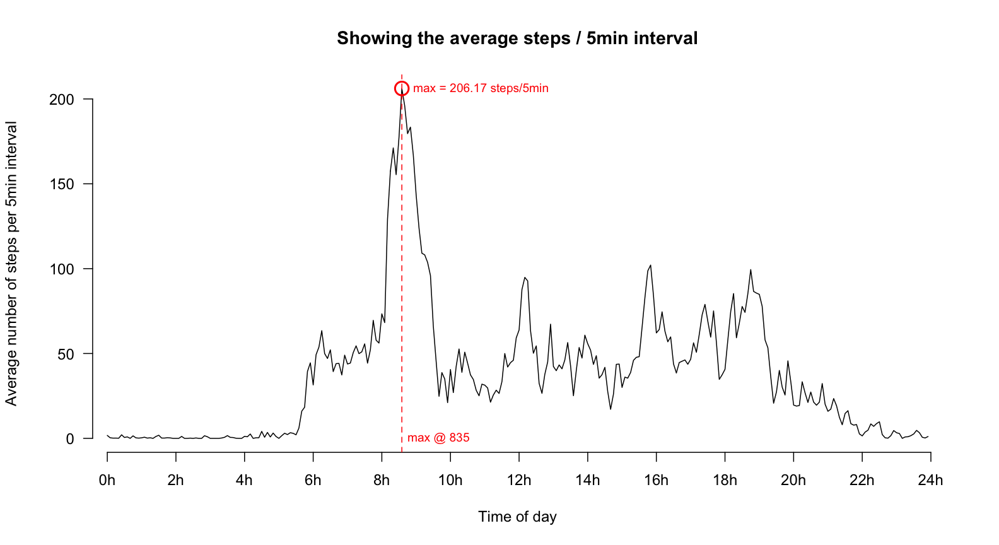

# Reproducible Research: Peer Assessment 1

Setting locale to en_US.


## Loading and preprocessing the data


```r
data <- read.csv("activity.csv")
data$date <- strptime(data$date, format="%Y-%m-%d")
```

## What is mean total number of steps taken per day?

### Histogram showing the total number of steps taken each day


### Simple Statistics 

The mean for steps / day is __10766.19__.

The median for steps / day is __10765.00__.

## What is the average daily activity pattern?



## Imputing missing values

There are __2304__ values missing in the original dataset.

We create a new copy of that dataset and impute the missing values from the corresponding 5min interval average.


```r
newdata <- data

for(i in seq(1, nrow(data)) ) {
    if ( is.na(data$steps[i]) ) {
        newdata$steps[i] <- averagePerInterval[[as.character(data$interval[i])]]
    }
}
```

### Resulting histogram with imputed data
### Histogram showing the total number of steps taken each day


### Simple Statistics for new dataset

The new mean for steps / day is __10766.19__.

The new median for steps / day is __10766.19__.

Both values are now identical.
With the original dataset the median was a tiny bit lower than the mean.

## Are there differences in activity patterns between weekdays and weekends?


As shown in the graphs below there is quite a difference between weekends (A) and weekdays (B) in total average steps / 5min interval.
On a weekend the maximum average of __175.00__ is at about __915__h (green). But on a weekday the maximum average of __234.10__ is at about __835__h (orange). Thats about __40__min earlier.

The blue lines (a,b,c) in both activity diagrams show times which are quite different between weekends and weekdays.
* a) On weekdays there is a lot more activity between about 6h and 8h present than on a weekend. This is likely to be caused of people getting up early for work.
* b) On weekends there's a lot more activity from noon into the afternoon. This could likely be caused by shopping activities.
* c) On weekends there's also clearly more activity in the early evening. This is likely from social activities.

The activity patterns between weekday and weekend are clearly different!


